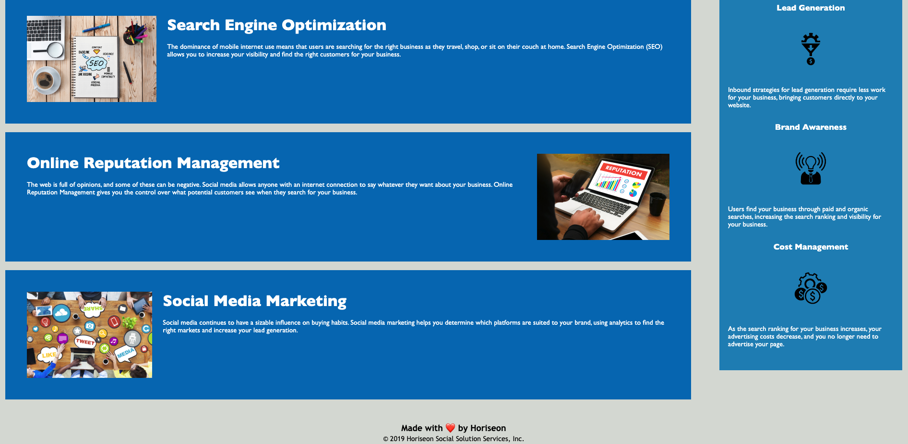

# Code Refactor Starter Code

## Description

This is Module 1 HTML, CSS, GIT Challenge: Code Refactor. Refactor the code for accessibility without changing what it does. 

## Installation

N/A

## Usage

Horiseon website has all working links, alt attributes to image tags, logical structure of HTML/CSS, and updated title element. 

## Credits

N/A

## Horiseon Screenshots

## License

N/A

